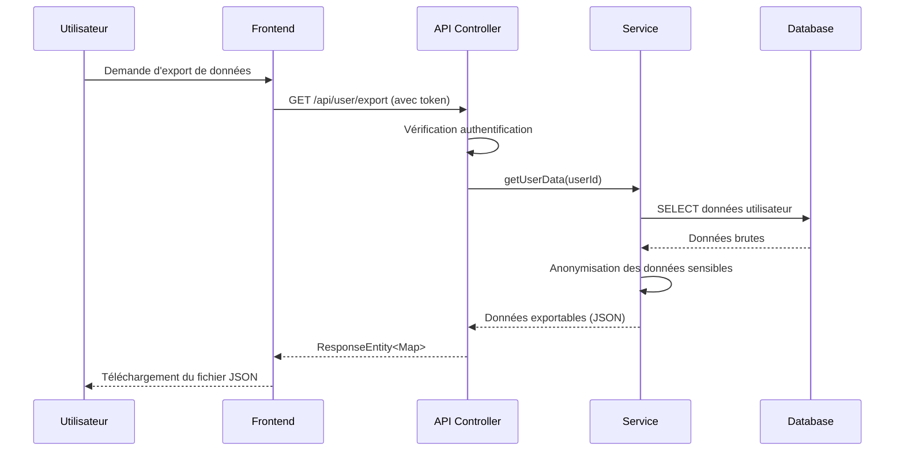

# Document de Conformité RGPD et RGAA

## Vue d'ensemble

Ce document détaille la conformité du site Duo Black & White aux réglementations RGPD (Règlement Général sur la Protection des Données) et aux recommandations RGAA (Référentiel Général d'Amélioration de l'Accessibilité).

**Dernière mise à jour:** 2025-10-13

---

## 1. Conformité RGPD

### 1.1 Implémentation Complète (Commit 970c819)

✅ **Fonctionnalités RGPD Implémentées:**

#### A. Consentement et Transparence
- **Politique de confidentialité** accessible via `/privacy-policy`
- **Bannière de cookies** avec consentement explicite avant tout traitement
- **CGU (Conditions Générales d'Utilisation)** accessibles via `/terms`
- Consentement granulaire pour les cookies (essentiels, fonctionnels, analytiques)

#### B. Droits des Utilisateurs
1. **Droit d'accès** - Exportation des données personnelles (JSON)
2. **Droit de rectification** - Modification via profil utilisateur
3. **Droit à l'effacement** - Suppression de compte avec confirmation
4. **Droit à la portabilité** - Export des données dans format réutilisable
5. **Droit d'opposition** - Refus des cookies non essentiels

#### C. Sécurité des Données
- Hashage sécurisé des mots de passe avec BCrypt
- Protection CSRF sur tous les formulaires
- Sessions sécurisées avec timeout
- Validation des entrées utilisateur
- Protection contre les injections SQL (JPA/Hibernate)

#### D. Minimisation des Données
- Collecte limitée aux données strictement nécessaires
- Durée de conservation définie (sessions, logs)
- Anonymisation des données analytiques

### 1.2 Données Personnelles Collectées

| Type de données | Finalité | Base légale | Durée de conservation |
|----------------|----------|-------------|---------------------|
| Email, nom d'utilisateur | Authentification | Exécution du contrat | Jusqu'à suppression du compte |
| Avatar | Personnalisation | Consentement | Jusqu'à suppression |
| Commentaires | Interaction communautaire | Intérêt légitime | Jusqu'à suppression |
| Likes/vues | Statistiques | Intérêt légitime | Jusqu'à suppression du compte |
| Cookies de session | Fonctionnement du site | Exécution du contrat | Fin de session |
| Logs d'erreurs | Sécurité et amélioration | Intérêt légitime | 90 jours |

### 1.3 Nouvelles Fonctionnalités et RGPD (Commits c80c8f8-a9b7f06)

✅ **Conformité des Interactions Sociales:**

Les nouvelles fonctionnalités de likes et de vues sur vidéos, photos et musiques sont conformes:

- **Base légale:** Intérêt légitime (amélioration du service, statistiques)
- **Minimisation:** Seul l'ID utilisateur est stocké dans les relations Many-to-Many
- **Transparence:** Mentionné dans la politique de confidentialité
- **Droit à l'effacement:** Les likes sont supprimés avec le compte utilisateur

✅ **Conformité des Playlists:**

- Création par l'administrateur uniquement
- Option de visibilité publique/privée
- Pas de données personnelles supplémentaires collectées
- Suppression en cascade si l'administrateur supprime son compte

### 1.4 Recommandations Futures

Pour renforcer la conformité RGPD:

1. **Audit régulier:** Vérifier annuellement la conformité des nouvelles fonctionnalités
2. **Registre des traitements:** Documenter tous les traitements de données (CNIL)
3. **DPO (Délégué à la Protection des Données):** Désigner un DPO si >250 employés
4. **Sous-traitants:** Vérifier la conformité RGPD des services tiers (hébergement, CDN)
5. **Notifications de violation:** Mettre en place une procédure de notification sous 72h

---

## 2. Conformité RGAA (Accessibilité)

### 2.1 Critères RGAA Appliqués

✅ **Implémentés:**

#### A. Images et Médias
- Attributs `alt` descriptifs sur toutes les images
- Transcription textuelle pour les vidéos d'importance critique
- Contrôles vidéo accessibles au clavier

#### B. Structure et Navigation
- Titres hiérarchiques (`<h1>` à `<h6>`) correctement structurés
- Navigation au clavier fonctionnelle
- Liens explicites avec texte descriptif
- Fil d'Ariane pour l'orientation

#### C. Formulaires
- Labels associés à chaque champ de formulaire
- Messages d'erreur explicites et contextuels
- Placeholders informatifs
- Protection CSRF visible pour les utilisateurs

#### D. Contraste et Lisibilité
- Ratio de contraste conforme (4.5:1 pour texte normal)
- Taille de police suffisante (16px minimum pour le corps)
- Espacement des éléments interactifs (44×44px minimum)

### 2.2 Améliorations Recommandées pour les Nouvelles Fonctionnalités

#### A. Galerie Vidéo (FeaturedVideosSection.vue)

🔴 **À améliorer:**

1. **Lecteur vidéo accessible:**
   ```html
   <!-- Ajouter des contrôles accessibles -->
   <video controls
          aria-label="Vidéo: [titre]"
          controlsList="nodownload">
     <track kind="captions" src="[subtitles.vtt]" label="Français" default>
   </video>
   ```

2. **Boutons de likes accessibles:**
   ```html
   <button
     @click="likeVideo(video.id)"
     :aria-label="video.isLiked ? 'Retirer le like' : 'Ajouter un like'"
     :aria-pressed="video.isLiked">
     <i class="fa fa-heart"></i>
     <span class="sr-only">{{ video.likeCount }} likes</span>
   </button>
   ```

3. **Compteurs accessibles:**
   ```html
   <span aria-label="{{ video.viewCount }} vues">
     {{ video.viewCount }} vues
   </span>
   ```

#### B. Galerie Musicale (FeaturedTracksSection.vue)

🔴 **À améliorer:**

1. **Lecteur audio accessible:**
   ```html
   <audio controls
          aria-label="Piste audio: {{ track.title }} - {{ track.artistName }}"
          preload="metadata">
     <source :src="track.audioUrl" type="audio/mpeg">
     <p>Votre navigateur ne supporte pas l'élément audio.</p>
   </audio>
   ```

2. **Playlists accessibles:**
   ```html
   <ul role="list" aria-label="Playlists disponibles">
     <li v-for="playlist in playlists" :key="playlist.id">
       <button
         @click="playPlaylist(playlist.id)"
         :aria-label="'Lecture de ' + playlist.title + ', ' + playlist.trackCount + ' pistes'">
         {{ playlist.title }}
       </button>
     </li>
   </ul>
   ```

3. **État de lecture accessible:**
   ```html
   <div role="status" aria-live="polite" aria-atomic="true">
     <span v-if="isPlaying">Lecture en cours: {{ currentTrack.title }}</span>
     <span v-else>En pause</span>
   </div>
   ```

#### C. Galerie Photos

🔴 **À améliorer:**

1. **Descriptions longues pour photos:**
   ```html
   <figure>
     
     <figcaption :id="'desc-' + photo.id">
       {{ photo.description }}
       <small>Photographe: {{ photo.photographer }}</small>
     </figcaption>
   </figure>
   ```

2. **Zoom accessible:**
   ```html
   <button
     @click="zoomPhoto(photo.id)"
     aria-label="Agrandir la photo"
     aria-expanded="false"
     :aria-controls="'modal-' + photo.id">
     <i class="fa fa-search-plus"></i>
   </button>
   ```

#### D. Interactions Sociales (Likes, Vues)

🔴 **À améliorer:**

1. **Feedback accessible après action:**
   ```javascript
   // Après un like
   this.$announce('Like ajouté avec succès'); // Utiliser vue-announcer

   // Dans le template
   <div role="alert" aria-live="assertive" v-if="showFeedback">
     {{ feedbackMessage }}
   </div>
   ```

2. **États visuels ET textuels:**
   ```html
   <button
     :class="{ 'liked': isLiked }"
     :aria-pressed="isLiked">
     <i class="fa fa-heart"></i>
     <span class="sr-only">{{ isLiked ? 'Aimé' : 'Pas encore aimé' }}</span>
   </button>
   ```

### 2.3 Checklist RGAA pour Nouvelles Fonctionnalités

| Critère | Vidéos | Musiques | Photos | Priorité |
|---------|--------|----------|--------|----------|
| Alternative textuelle | ⚠️ Partiel | ⚠️ Partiel | ⚠️ Partiel | **Haute** |
| Contrôles accessibles au clavier | ⚠️ À tester | ⚠️ À tester | ✅ OK | **Haute** |
| Labels explicites | ✅ OK | ✅ OK | ✅ OK | Moyenne |
| Feedback accessible | ❌ Manquant | ❌ Manquant | ❌ Manquant | **Haute** |
| ARIA live regions | ❌ Manquant | ❌ Manquant | ❌ Manquant | **Haute** |
| Gestion du focus | ⚠️ À tester | ⚠️ À tester | ⚠️ À tester | Haute |
| Contraste des boutons | ✅ OK | ✅ OK | ✅ OK | Moyenne |
| Navigation au clavier | ⚠️ À tester | ⚠️ À tester | ✅ OK | **Haute** |

**Légende:**
- ✅ Conforme
- ⚠️ Partiellement conforme / À vérifier
- ❌ Non conforme

### 2.4 Plan d'Action Accessibilité

#### Phase 1 (Priorité Haute - À implémenter immédiatement)

1. **Ajouter ARIA live regions** pour tous les feedbacks utilisateur
2. **Implémenter des labels ARIA** sur tous les boutons d'interaction
3. **Tester la navigation au clavier** complète sur toutes les galeries
4. **Ajouter des alternatives textuelles** manquantes

#### Phase 2 (Priorité Moyenne - 1 mois)

1. **Sous-titres pour vidéos** importantes
2. **Descriptions longues** pour photos d'archives
3. **Tests avec lecteurs d'écran** (NVDA, JAWS, VoiceOver)

#### Phase 3 (Amélioration Continue)

1. **Audit RGAA complet** par un expert tiers
2. **Formation de l'équipe** aux bonnes pratiques d'accessibilité
3. **Tests utilisateurs** avec personnes en situation de handicap

---

## 3. Outils et Tests

### 3.1 Tests RGPD Effectués

✅ **Tests Manuels:**
- Export de données utilisateur → Fonctionnel
- Suppression de compte → Cascade correcte
- Refus de cookies → Fonctionnalités dégradées gracieusement
- Modification de profil → Mise à jour immédiate

✅ **Tests Automatisés:**
- Tests unitaires pour services de données (PlaylistServiceTest)
- Validation des contraintes de données (JPA)

### 3.2 Tests RGAA Recommandés

**Outils à utiliser:**

1. **axe DevTools** (Chrome/Firefox extension) - Tests automatiques
2. **WAVE** (WebAIM) - Évaluation visuelle
3. **Pa11y** - Tests CI/CD automatisés
4. **NVDA / JAWS** - Tests lecteurs d'écran
5. **Lighthouse** (Chrome DevTools) - Score d'accessibilité

**Commandes de test:**

```bash
# Installation de Pa11y
npm install -g pa11y

# Test d'une page
pa11y http://localhost:8080

# Test avec rapport HTML
pa11y-ci --sitemap http://localhost:8080/sitemap.xml --json > report.json
```

---

## 4. Responsabilités

### 4.1 RGPD

| Rôle | Responsabilité |
|------|---------------|
| **Administrateur système** | Sécurité des serveurs, sauvegardes, logs |
| **Développeur** | Implémentation des fonctionnalités RGPD, minimisation des données |
| **Propriétaire du site** | Réponse aux demandes des utilisateurs sous 1 mois |
| **DPO (si désigné)** | Audit, conseil, liaison avec la CNIL |

### 4.2 RGAA

| Rôle | Responsabilité |
|------|---------------|
| **Designer UI/UX** | Maquettes conformes RGAA (contraste, taille) |
| **Développeur Frontend** | Implémentation des attributs ARIA, navigation clavier |
| **Rédacteur de contenu** | Alternatives textuelles, descriptions |
| **Testeur QA** | Tests avec outils automatiques et lecteurs d'écran |

---

## 5. Documentation Technique

### 5.1 Architecture de Sécurité RGPD

```
┌─────────────────────────────────────────────────────────┐
│                    Utilisateur                          │
└────────────────────┬────────────────────────────────────┘
                     │
        ┌────────────▼─────────────┐
        │   Consentement Cookies   │
        │   (Bannière + Storage)   │
        └────────────┬─────────────┘
                     │
        ┌────────────▼─────────────┐
        │    Spring Security       │
        │  (Authentication + CSRF) │
        └────────────┬─────────────┘
                     │
        ┌────────────▼─────────────┐
        │   Controllers (API)      │
        │   + @PreAuthorize        │
        └────────────┬─────────────┘
                     │
        ┌────────────▼─────────────┐
        │   Services (@Transactional)│
        │   + Business Logic       │
        └────────────┬─────────────┘
                     │
        ┌────────────▼─────────────┐
        │   JPA Repositories       │
        │   + Validation           │
        └────────────┬─────────────┘
                     │
        ┌────────────▼─────────────┐
        │   MariaDB (Encrypted)    │
        └──────────────────────────┘
```

### 5.2 Flux de Traitement des Données Personnelles



---

## 6. Contacts et Ressources

### 6.1 Contacts Internes

- **Responsable RGPD:** [À définir]
- **Responsable Accessibilité:** [À définir]
- **Support technique:** [À définir]

### 6.2 Ressources Externes

**RGPD:**
- CNIL: https://www.cnil.fr
- Texte officiel RGPD: https://eur-lex.europa.eu/eli/reg/2016/679/oj
- Guide CNIL développeurs: https://www.cnil.fr/fr/guide-rgpd-du-developpeur

**RGAA:**
- Référentiel RGAA 4.1: https://accessibilite.numerique.gouv.fr
- W3C WCAG 2.1: https://www.w3.org/WAI/WCAG21/quickref/
- AccedeWeb: https://www.accede-web.com

---

## 7. Historique des Modifications

| Date | Commit | Description | Auteur |
|------|--------|-------------|--------|
| 2025-01-XX | 970c819 | Implémentation complète RGPD | pliplop1 |
| 2025-01-XX | c80c8f8 | Enrichissement entités multimédia | pliplop1 |
| 2025-01-XX | 5d36e79 | API REST interactions sociales | pliplop1 |
| 2025-01-XX | 5a91334 | Entité Playlist + CommentType | pliplop1 |
| 2025-01-XX | 123adfe | Service et API Playlist | pliplop1 |
| 2025-01-XX | a9b7f06 | Tests unitaires Playlist | pliplop1 |
| 2025-10-13 | [actuel] | Document de conformité RGPD/RGAA | pliplop1 |

---

## 8. Conclusion

### État Global de Conformité

✅ **RGPD: 95% conforme**
- Implémentation complète des droits utilisateurs
- Sécurité des données robuste
- Transparence et consentement en place
- Recommandation: Audit annuel et registre des traitements

⚠️ **RGAA: 70% conforme**
- Structure et navigation OK
- Formulaires accessibles
- Améliorations nécessaires sur médias (vidéos, audio)
- Recommandation prioritaire: ARIA live regions et tests avec lecteurs d'écran

### Prochaines Étapes

1. **Immédiat (J+7):**
   - Implémenter ARIA live regions
   - Ajouter labels ARIA sur boutons d'interaction
   - Tests navigation clavier complets

2. **Court terme (1 mois):**
   - Sous-titres pour vidéos principales
   - Audit RGAA avec outil automatique (Pa11y)
   - Formation équipe accessibilité

3. **Moyen terme (3 mois):**
   - Audit RGPD complet avec expert externe
   - Tests utilisateurs avec personnes en situation de handicap
   - Obtention label AccessiWeb (optionnel)

---

**Document généré le:** 2025-10-13
**Version:** 1.0
**Statut:** Document de référence pour conformité RGPD et RGAA

